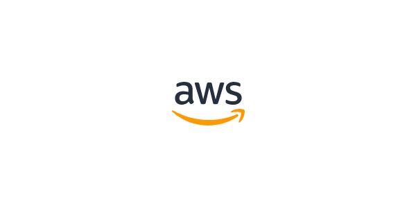

## Cloud computing

- _Cloud computing_ is the on-demand delivery of IT resources over the Internet with pay-as-you-go pricing.
- Instead of buying, owning, and maintaining physical data centers and servers, you can access technology services, such as computing power, storage, and databases, on an as-needed basis from a cloud provider.

### Advantages of cloud computing

1. Trade capital expense for variable expense - pay only when you consume
2. Benefit from massive economies of scale - lower pay-as-you-go prices
3. Stop guessing capacity - access as much or little capacity as you need
4. Increase speed and agility - a click away IT resources
5. Stop spending money running and maintaining data centers - focus on projects, not the infrastructure
6. Go global in minutes - low latency with easily deployed application in multiple regions

### Types of cloud computing

1. **Infrastructure-as-a-Service (IaaS)** provides access to networking features, computers, and data storage space. It provides you with the highest level of flexibility and management control over your IT resources.
2. **Platform-as-a-Service (PaaS)** removes the need for management the underlying infrastructure (usually hardware and OS). You don't need to worry about resource procurement, capacity planning, software maintenance, patching, etc.
3. **Software-as-a-Service (SaaS)** provides a completed product that is run and managed by the service provider. i.e., web-based email which you can use to send and receive email without having to manage feature additions or maintain the servers and OS.

### Cloud computing deployment models

- Factors to be considered for selecting a cloud strategy:
  - Required cloud application components
  - Preferred resource management tools
  - Any legacy IT infrastructure requirements.

#### 1. Cloud-based deployment

- Run all parts of the application in the cloud.
- Migrate existing applications to the cloud.
- Design and build new applications in the cloud.

#### 2. On-premises deployment

- Private cloud deployment
- Deploy resources by using virtualization and resource management tools.
- Increase resource utilization by using application management and virtualization technologies.

#### 3. Hybrid deployment

- Connect cloud-based resources to on-premises infrastructure.
- Integrate cloud-based resources with legacy IT applications.

## Serverless computing

- _Serverless_ means that your code runs on servers, but you do not need to provision or manage these servers.
- It gives the flexibility to scale serverless applications automatically.
- Serverless computing can adjust the applications' capacity by modifying the units of consumptions, such as throughput and memory.
- You cannot see or access the underlying infrastructure or instances.

---

## References

1. [AWS glossary](https://docs.aws.amazon.com/general/latest/gr/glos-chap.html)
2. [AWS white paper](https://d0.awsstatic.com/whitepapers/aws-overview.pdf)
